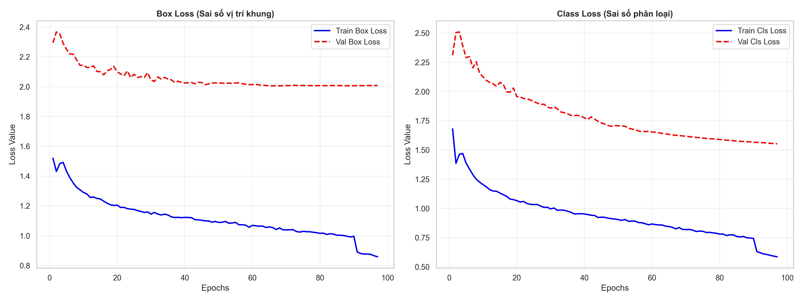
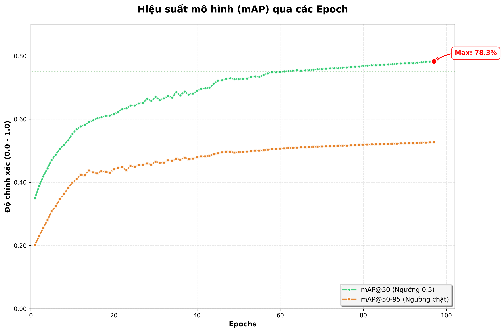
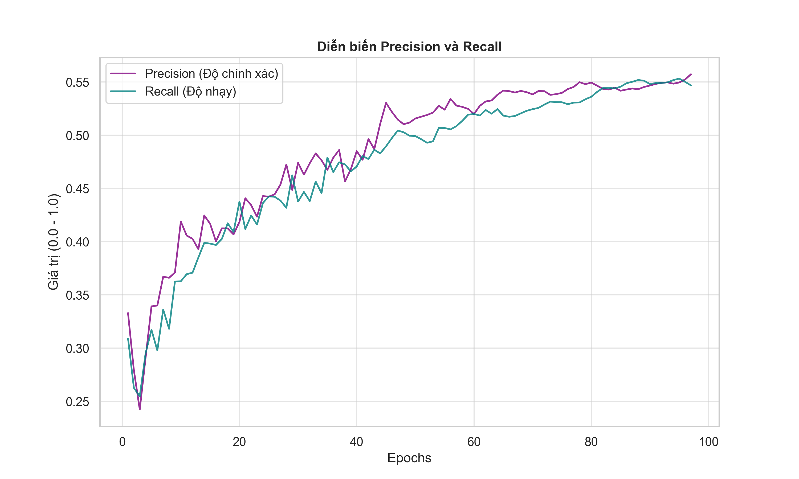
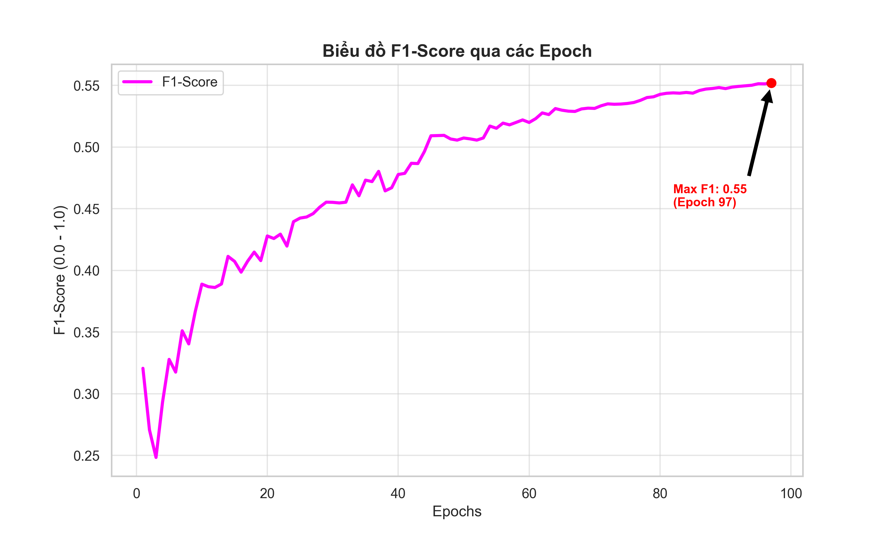
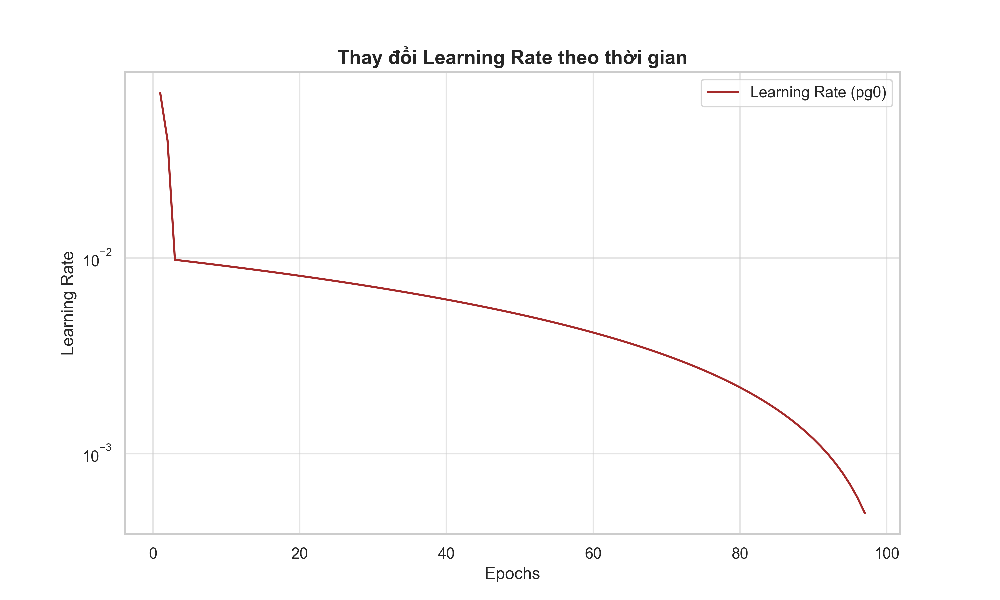

<div align="center">


# HeThongBaoChay - Hệ Thống Báo Cháy Thông Minh

Nền tảng phát hiện lửa và khói theo thời gian thực bằng YOLO, tích hợp FastAPI, Flutter và ESP32-CAM.


</div>

## Mục Lục

1. [Giới Thiệu](#giới-thiệu)
2. [Tính Năng Chính](#tính-năng-chính)
3. [Kiến Trúc Hệ Thống](#kiến-trúc-hệ-thống)
4. [Cấu Trúc Dự Án](#cấu-trúc-dự-án)
5. [Yêu Cầu Môi Trường](#yêu-cầu-môi-trường)
6. [Hướng Dẫn Cài Đặt Nhanh](#hướng-dẫn-cài-đặt-nhanh)
7. [Vận Hành Hệ Thống](#vận-hành-hệ-thống)
8. [Đánh Giá Mô Hình](#đánh-giá-mô-hình)
9. [API Tổng Quan](#api-tổng-quan)
10. [ESP32-CAM và Firebase](#esp32-cam-và-firebase)
11. [Troubleshooting](#troubleshooting)
12. [Tài Liệu Liên Quan](#tài-liệu-liên-quan)

## Giới Thiệu

Dự án xây dựng hệ thống cảnh báo cháy thông minh với mục tiêu:

- Phát hiện lửa và khói theo thời gian thực từ camera điện thoại hoặc ESP32-CAM.
- Cung cấp API phân tích ảnh/video cho web, mobile và thiết bị IoT.
- Gửi cảnh báo tức thời lên ứng dụng Flutter qua Firebase Cloud Messaging.
- Theo dõi hiệu suất mô hình bằng mAP, Precision, Recall, F1-Score và Loss.

## Tính Năng Chính

- Phát hiện lửa/khói trên ảnh, video, camera stream và ESP32 stream.
- Trả kết quả dạng JSON hoặc ảnh/video đã vẽ bounding box.
- Cảnh báo theo mức độ nghiêm trọng (HIGH, MEDIUM, LOW).
- Theo dõi tiến trình huấn luyện bằng TensorBoard và biểu đồ trực quan.
- Ứng dụng Flutter hỗ trợ giám sát, cảnh báo và hiển thị thống kê.

## Kiến Trúc Hệ Thống

<div align="center">


</div>

Luồng dữ liệu chính:

```text
ESP32-CAM / Mobile Camera
            -> OpenCV + YOLO Inference
            -> FastAPI Backend
            -> Firebase Cloud Messaging
            -> Flutter Mobile App (Alert + Monitoring)
```

## Cấu Trúc Dự Án

```text
HeThongBaoChay/
|- main.py                      # Entry point FastAPI
|- config.py                    # Cấu hình hệ thống
|- api_state.py                 # Quản lý trạng thái runtime
|- requirements.txt
|- README.md
|
|- routers/                     # API routers
|  |- root.py
|  |- images.py
|  |- video.py
|  |- camera.py
|  |- esp32.py
|  |- mobile.py
|
|- services/                    # Business logic
|  |- detection.py
|  |- fire_tracker.py
|  |- notifications.py
|
|- scripts/                     # Script train/test/deploy tool
|  |- train_yolo_model.py
|  |- test_camera_api.py
|  |- esp32_flask_stream_server.py
|  |- upload_model_huggingface.py
|
|- app/                         # Flutter application
|- hardware/esp32/              # Firmware ESP32-CAM
|- docs/                        # Tài liệu bổ sung
|- notebooks/                   # Notebook huấn luyện
|- models/                      # Trọng số mô hình
|- report_images1/              # Biểu đồ kết quả training
```

## Yêu Cầu Môi Trường

- Python 3.10 trở lên
- Flutter SDK (nếu chạy app mobile)
- Android SDK hoặc thiết bị/emulator Android
- ESP32-CAM (tùy chọn, nếu dùng luồng camera IoT)
- GPU CUDA (khuyến nghị cho huấn luyện)

## Hướng Dẫn Cài Đặt Nhanh

### 1) Cài backend

```bash
python -m venv venv
.\venv\Scripts\Activate.ps1
pip install -r requirements.txt
```

### 2) Chạy API server

```bash
uvicorn main:app --host 0.0.0.0 --port 8000 --reload
```

API mặc định tại: http://localhost:8000

### 3) Chạy Flutter app

```bash
cd app
flutter pub get
flutter run
```

### 4) Kiểm tra ESP32 stream (tùy chọn)

```bash
python scripts/test_camera_api.py
```

## Vận Hành Hệ Thống

### Nhánh sử dụng trên mobile

1. Mở app và cấp quyền camera.
2. Vào tính năng phát hiện lửa/khói.
3. Bắt đầu suy luận thời gian thực.
4. Theo dõi cảnh báo và trạng thái detection.

### Nhánh sử dụng ESP32-CAM

1. Cấu hình WiFi trong firmware ESP32.
2. Nạp code vào ESP32-CAM.
3. Lấy IP từ Serial Monitor.
4. Cập nhật IP vào dịch vụ kết nối trong app/script.

## Đánh Giá Mô Hình

Phần này đã tích hợp các biểu đồ bạn cung cấp để phục vụ báo cáo và theo dõi chất lượng mô hình.

### Tổng quan chỉ số cuối quá trình train

- mAP@50: khoảng 78.3%
- mAP@50-95: khoảng 52%
- Precision: khoảng 0.55
- Recall: khoảng 0.55
- F1-Score: khoảng 0.55 (đỉnh ở epoch cuối)

### 1) Box Loss và Class Loss



Nhận xét nhanh:

- Train loss giảm đều, mô hình học ổn định.
- Validation loss giảm chậm và cao hơn train loss, cho thấy còn khoảng cách tổng quát hóa.

### 2) Hiệu suất mAP theo epoch



Nhận xét nhanh:

- mAP@50 tăng đều và đạt mức cao nhất ở giai đoạn cuối.
- mAP@50-95 tăng ổn định, phản ánh cải thiện ở ngưỡng IoU nghiêm ngặt.

### 3) Precision và Recall



Nhận xét nhanh:

- Precision và Recall hội tụ khá cân bằng quanh 0.55.
- Đường cong mượt, ít dao động mạnh ở nửa sau training.

### 4) F1-Score



Nhận xét nhanh:

- F1 tăng liên tục và đạt cực đại ở epoch cuối.
- Mô hình vẫn còn xu hướng cải thiện nếu tối ưu thêm dữ liệu/hyperparameters.

### 5) Learning Rate Schedule



Nhận xét nhanh:

- Learning rate giảm dần theo lịch, giúp ổn định giai đoạn fine-tuning cuối.

## API Tổng Quan

Base URL: http://localhost:8000

Một số endpoint chính:

- GET / : Thông tin API
- GET /health/ : Kiểm tra trạng thái server và model
- POST /predict/ : Dự đoán ảnh, trả ảnh đã annotate
- POST /predict_json/ : Dự đoán ảnh, trả JSON
- POST /analyze_video/ : Phân tích video
- POST /camera/start/ : Khởi tạo camera session
- GET /camera/stream/ : Stream MJPEG
- POST /camera/stop/ : Dừng camera
- POST /mobile/camera/detect : API cho mobile camera

Ví dụ gọi API:

```bash
curl -X POST -F "file=@image.jpg" http://localhost:8000/predict_json/
```

## ESP32-CAM và Firebase

### ESP32-CAM

1. Mở file firmware tại hardware/esp32/ESP32_CAMERA_CODE.ino.
2. Khai báo SSID và password WiFi.
3. Upload firmware và kiểm tra IP qua Serial Monitor.

### Firebase Cloud Messaging

1. Tạo project trên Firebase Console.
2. Thêm Android app và tải file google-services.json.
3. Đặt file vào app/android/app/google-services.json.
4. Kiểm tra khởi tạo Firebase trong app Flutter.

## Troubleshooting

### Không kết nối được API

- Kiểm tra server đã chạy và đúng port 8000.
- Kiểm tra thiết bị mobile cùng mạng LAN với máy chủ.
- Cập nhật API base URL trong app Flutter theo IP máy chủ.

### Model không được nạp

- Kiểm tra đường dẫn model trong cấu hình runtime.
- Đảm bảo file weight tồn tại trong thư mục training results hoặc models.

### ESP32 không stream

- Kiểm tra nguồn cấp ổn định cho ESP32-CAM.
- Kiểm tra IP, WiFi và endpoint capture/stream.

### Huấn luyện chậm

- Dùng GPU CUDA nếu có.
- Giảm batch size hoặc ảnh đầu vào.
- Bật TensorBoard để theo dõi nghẽn hiệu năng.

## Tài Liệu Liên Quan

- [Tài liệu ESP32 Flask Stream](docs/ESP32_FLASK_SERVER.md)
- [Notebook train YOLO](notebooks/train_yolo_colab_vscode.ipynb)
- [README Flutter app](app/README.md)

## License

Dự án sử dụng giấy phép MIT.
