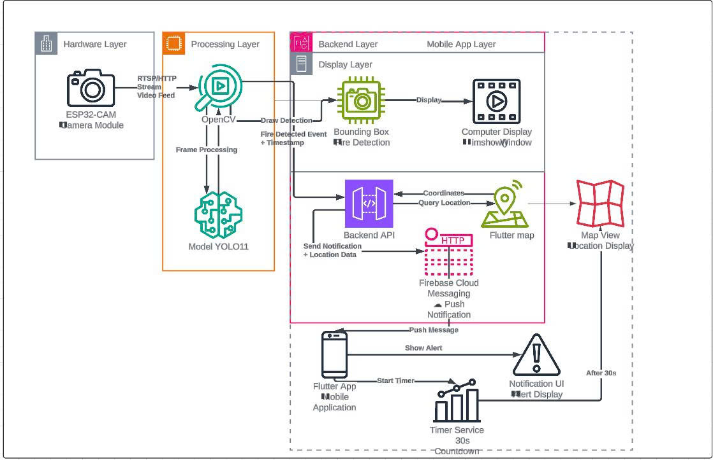

<div align="center">


#  Hệ Thống Báo Cháy Thông Minh - AI Fire & Smoke Detection

*AI-Powered Fire Detection System for Smart Safety*

</div>

Dự án phát triển hệ thống báo cháy thông minh sử dụng YOLOv11 AI để phát hiện lửa và khói với độ chính xác cao, tích hợp Flutter mobile app và ESP32-CAM.

##  Mục Lục

1. [Tổng Quan](#tổng-quan)
2. [Tính Năng Chính](#tính-năng-chính)
3. [Cấu Trúc Dự Án](#cấu-trúc-dự-án)
4. [Cài Đặt Nhanh](#cài-đặt-nhanh)
5. [Hướng Dẫn Sử Dụng](#hướng-dẫn-sử-dụng)
6. [Cấu Hình ESP32-CAM](#cấu-hình-esp32-cam)
7. [Cấu Hình Firebase](#cấu-hình-firebase)
8. [Training Model YOLOv11](#training-model-yolov11)
9. [API Documentation](#api-documentation)
10. [Troubleshooting](#troubleshooting)
11. [Tài Liệu Kỹ Thuật](#tài-liệu-kỹ-thuật)

---

##  Tổng Quan

Hệ thống báo cháy thông minh sử dụng:
- **YOLOv11 AI Model**: Phát hiện lửa và khói với độ chính xác cao
- **Flutter Mobile App**: Giao diện người dùng đẹp, dễ sử dụng
- **FastAPI Backend**: API server xử lý detection real-time
- **ESP32-CAM**: Camera giám sát không dây
- **Firebase FCM**: Push notifications miễn phí

### Kiến Trúc Hệ Thống

Hệ thống được thiết kế theo kiến trúc 4 tầng chính:

<div align="center">



*Sơ đồ kiến trúc hệ thống báo cháy thông minh*

</div>

**Mô tả các tầng:**

1. **Hardware Layer (Tầng Phần Cứng)**
   - ESP32-CAM Camera Module: Thu thập video feed qua RTSP/HTTP
   - Streaming video trực tiếp đến Processing Layer

2. **Processing Layer (Tầng Xử Lý)**
   - **OpenCV**: Xử lý frame-by-frame từ video stream
   - **YOLO11 Model**: Phát hiện lửa và khói với bounding boxes
   - Tạo sự kiện "Fire Detected" kèm timestamp
   - Vẽ bounding boxes lên video để hiển thị

3. **Backend Layer (Tầng Backend)**
   - **Backend API**: Nhận sự kiện phát hiện cháy và xử lý
   - **Firebase Cloud Messaging**: Gửi push notification đến mobile app
   - **Display Layer**: Hiển thị video với bounding boxes trên máy tính
   - Quản lý tọa độ và truy vấn vị trí đám cháy

4. **Mobile App Layer (Tầng Ứng Dụng Di Động)**
   - **Flutter App**: Nhận push notification và hiển thị cảnh báo
   - **Map View**: Hiển thị vị trí đám cháy trên bản đồ
   - **Timer Service**: Đếm ngược 30 giây sau khi nhận cảnh báo
   - **Notification UI**: Hiển thị alert và thông tin chi tiết

**Luồng hoạt động:**
```
ESP32-CAM → OpenCV/YOLO11 → Backend API → Firebase FCM → Flutter App
                ↓                              ↓
         Display Layer (PC)            Map View + Alert
```

##  Tính Năng Chính

###  Phát Hiện Real-time
- Phát hiện lửa và khói từ camera điện thoại
- Phát hiện từ ESP32-CAM stream
- Phân tích video với bounding boxes
- Phân tích ảnh tĩnh

###  Mobile App (Flutter)
- Giao diện tiếng Việt thân thiện
- Real-time camera detection
- ESP32 streaming integration
- Hệ thống cảnh báo 3 cấp độ
- Thống kê chi tiết
- Bounding box visualization

###  Hệ Thống Cảnh Báo
- **HIGH**: Phát hiện lửa → Dialog cảnh báo khẩn cấp
- **MEDIUM**: Phát hiện khói → SnackBar thông báo
- **LOW**: An toàn → Hiển thị bình thường

###  Analytics & Monitoring
- TensorBoard integration
- Comprehensive metrics (mAP, Precision, Recall, F1-Score)
- Training visualization
- Real-time statistics

---

##  Cấu Trúc Dự Án

```
HeThongBaoChay/
├── app/                          # Flutter mobile application
│   ├── lib/
│   │   ├── main.dart
│   │   ├── screens/             # Các màn hình
│   │   ├── services/            # API services
│   │   ├── widgets/             # Reusable widgets
│   │   └── models/              # Data models
│   └── android/                 # Android configuration
│
├── data/                        # Training dataset (YOLO format)
│   ├── train/images/            # Training images
│   ├── train/labels/            # Training labels
│   ├── valid/images/            # Validation images
│   ├── valid/labels/            # Validation labels
│   ├── test/images/             # Test images
│   ├── test/labels/             # Test labels
│   └── data.yaml                # Dataset configuration
│
├── training_results_*/          # Training outputs
│   ├── weights/
│   │   ├── best.pt              # Best model
│   │   └── last.pt              # Last checkpoint
│   ├── plots/                   # Training visualizations
│   └── tensorboard/              # TensorBoard logs
│
├── main.py                      # FastAPI backend server
├── train_yolo_model.py          # Advanced training script
├── quick_train.py               # Quick training script
├── simple_train.py              # Simple training script
├── check_data.py                # Data verification
├── requirements.txt             # Python dependencies
├── ESP32_CAMERA_CODE.ino        # ESP32-CAM firmware
└── README.md                    # File này
```

---

##  Cài Đặt Nhanh

### Bước 1: Cài Đặt Python Dependencies

```bash
# Tạo virtual environment (khuyến nghị)
python -m venv venv
.\venv\Scripts\Activate.ps1  # Windows PowerShell
# hoặc
source venv/bin/activate      # Linux/Mac

# Cài đặt packages
pip install -r requirements.txt
```

### Bước 2: Khởi Động Backend API

```bash
cd e:\HeThongBaoChay
python main.py
```

Server sẽ chạy tại `http://localhost:8000`

### Bước 3: Cấu Hình Flutter App

```bash
cd app
flutter pub get
```

### Bước 4: Cập Nhật IP Address

Sửa file `app/lib/constants.dart`:
```dart
// Thay 'localhost' bằng IP máy tính (kiểm tra bằng ipconfig)
const String API_BASE_URL = 'http://192.168.1.XXX:8000';
```

### Bước 5: Chạy App

```bash
flutter run
```

---

##  Hướng Dẫn Sử Dụng

### Camera Detection (Điện Thoại)

1. **Mở app** → Đăng nhập
2. **Nhấn nút "Phát Hiện Lửa"** ở giữa màn hình
3. **Cho phép quyền camera**
4. **Nhấn "BẮT ĐẦU"**
5. **Hướng camera** vào vật cần kiểm tra
6. **Quan sát kết quả** với bounding boxes

### ESP32 Streaming

1. **Tab "ESP32 Streaming"** trong app
2. **Nhấn "Kết Nối"** (đã cấu hình IP ESP32)
3. **Bật "Tự Động Phát Hiện"** để enable AI detection
4. **Xem stream real-time** với bounding boxes

### Video Analysis

1. **Tab "Dự Đoán"** → **"Chọn Video"**
2. **Upload video** có lửa/khói
3. **Nhấn "Phân Tích Ngay"**
4. **Xem kết quả** với video có bounding boxes

---

##  Cấu Hình ESP32-CAM

### Bước 1: Upload Firmware

1. Mở `ESP32_CAMERA_CODE.ino` trong Arduino IDE
2. Cài đặt ESP32 board support
3. Cấu hình WiFi credentials:
   ```cpp
   const char* ssid = "YOUR_WIFI_SSID";
   const char* password = "YOUR_WIFI_PASSWORD";
   ```
4. Upload code lên ESP32-CAM

### Bước 2: Lấy IP Address

1. Mở **Serial Monitor** (115200 baud)
2. Reset ESP32, xem output:
   ```
   WiFi connected
   Camera Ready! Use 'http://192.168.1.XXX' to connect
   ```
3. **Ghi lại IP này**

### Bước 3: Cập Nhật IP trong Flutter App

**File: `app/lib/services/esp32_streaming_service.dart`**
```dart
String _esp32IP = '192.168.1.100'; // ← THAY ĐỔI IP TẠI ĐÂY
```

### Bước 4: Test Kết Nối

- Mở browser: `http://192.168.1.100/capture`
- Nếu thấy ảnh từ camera → ESP32 hoạt động ✅

---

##  Cấu Hình Firebase (MIỄN PHÍ)

### Chi Phí: **0 VNĐ**

 Firebase Cloud Messaging (FCM): MIỄN PHÍ hoàn toàn  
 Không cần thẻ tín dụng cho FCM  
 Không có quota limits cho notifications

### Bước 1: Tạo Firebase Project

1. Truy cập: [Firebase Console](https://console.firebase.google.com/)
2. Tạo project mới hoặc chọn project có sẵn
3. **Add Android App**:
   - Package name: `com.example.app` (check trong `android/app/build.gradle`)
   - Download `google-services.json`
   - Copy vào: `android/app/google-services.json`

### Bước 2: Android Configuration

**File: `android/app/build.gradle`**
```gradle
// Add at top
apply plugin: 'com.google.gms.google-services'

dependencies {
    implementation 'com.google.firebase:firebase-messaging:23.2.1'
    implementation 'com.google.firebase:firebase-analytics'
}
```

**File: `android/build.gradle`**
```gradle
dependencies {
    classpath 'com.google.gms:google-services:4.3.15'
}
```

### Bước 3: Firebase Initialization

**File: `app/lib/main.dart`** (đã có sẵn):
```dart
await Firebase.initializeApp(
  options: DefaultFirebaseOptions.currentPlatform,
);
await NotificationService().init();
```

### Sử Dụng Notifications

```dart
// Gửi thông báo khi phát hiện lửa
if (hasFireDetection) {
  await NotificationService().sendFireAlert(
    location: 'Camera 1 - Phòng khách',
    confidence: 0.87,
  );
}
```

---

## 🎓 Training Model YOLOv11

### Cấu Trúc Dữ Liệu

```
data/
├── data.yaml           # File cấu hình YOLO
├── train/
│   ├── images/         # Ảnh training
│   └── labels/         # Labels training (YOLO format)
├── valid/
│   ├── images/         # Ảnh validation
│   └── labels/         # Labels validation
└── test/
    ├── images/         # Ảnh test
    └── labels/         # Labels test
```

### Bước 1: Kiểm Tra Dữ Liệu

```bash
python check_data.py
```

Script này sẽ:
-  Kiểm tra cấu trúc dữ liệu
-  Phân tích phân bố classes
-  Hiển thị ảnh mẫu với labels
-  Tạo biểu đồ thống kê

### Bước 2: Chọn Phương Pháp Training

#### 🏃‍♂️ Quick Training (Khuyến nghị cho người mới)
```bash
python quick_train.py
```
-  Dễ sử dụng, setup tự động
-  Best practices được tích hợp sẵn
-  Batch size tự động tối ưu
-  Thời gian: 2-4 giờ

#### 🔬 Advanced Training (Cho chuyên gia)
```bash
python train_yolo_model.py
```
-  Hyperparameter optimization với Optuna
-  Mixed precision training
-  TensorBoard integration
-  Ensemble model support
-  Thời gian: 4-8 giờ

####  Simple Training (Cho việc học)
```bash
python simple_train.py
```
- Dành cho học tập
- Code dễ hiểu
- Thời gian: 1-2 giờ

### Cấu Hình Training

```python
# Trong training script
results = model.train(
    data='data/data.yaml',     # Đường dẫn config
    epochs=50,                 # Số epochs (50-200)
    imgsz=640,                # Kích thước ảnh
    batch=8,                  # Batch size (4-32)
    device='cuda',            # 'cuda' hoặc 'cpu'
    lr0=0.01,                 # Learning rate
    patience=15,              # Early stopping
)
```

### Model Sizes

- `yolov11n.pt`: Nano (nhẹ nhất, nhanh nhất)
- `yolov11s.pt`: Small
- `yolov11m.pt`: Medium
- `yolov11l.pt`: Large
- `yolov11x.pt`: Extra Large (chính xác nhất)

### Kết Quả Mong Đợi

- **mAP@0.5**: > 0.85
- **mAP@0.5:0.95**: > 0.70
- **Precision**: > 0.87
- **Recall**: > 0.83
- **F1-Score**: > 0.85

### Monitoring Training

```bash
# Xem training progress real-time
tensorboard --logdir training_results_*/tensorboard
```

### Kết Quả Training

Sau khi training, các files sẽ được lưu trong:
```
training_results_YYYYMMDD_HHMMSS/
├── advanced_fire_smoke_yolo11s/
│   ├── weights/
│   │   ├── best.pt         # Model tốt nhất
│   │   └── last.pt         # Model cuối cùng
│   ├── results.csv         # Metrics theo epoch
│   └── train_batch*.jpg    # Training samples
├── plots/
│   └── data_analysis.png
└── tensorboard/
    └── events.out.tfevents.*
```

---

##  API Documentation

### Base URL
```
http://localhost:8000
```

### Endpoints

#### Information
- `GET /` - API information và danh sách endpoints
- `GET /health/` - Kiểm tra trạng thái API và model

#### Image Analysis
- `POST /predict/` - Phát hiện từ ảnh, trả về ảnh đã annotation (JPEG)
- `POST /predict_json/` - Phát hiện từ ảnh, trả về JSON
- `POST /mobile/camera/detect` - Phát hiện từ ảnh mobile với JSON response
- `POST /mobile/camera/detect_with_image` - Phát hiện từ ảnh mobile với ảnh annotation

#### Video Analysis
- `POST /analyze_video/` - Phân tích video file với frame-by-frame detection

#### Camera Streaming
- `POST /camera/start/` - Khởi tạo camera session
- `GET /camera/stream/` - MJPEG stream với real-time detection
- `POST /camera/stop/` - Dừng camera session
- `GET /camera/stats/` - Thống kê session và metrics

### Request/Response Examples

#### Image Detection (JSON)
```bash
curl -X POST -F "file=@image.jpg" http://localhost:8000/predict_json/
```

**Response:**
```json
{
  "success": true,
  "timestamp": "2024-12-05T10:30:00",
  "detections": [
    {
      "class": "fire",
      "confidence": 0.85,
      "bbox": {
        "x1": 100,
        "y1": 150,
        "x2": 200,
        "y2": 250
      }
    }
  ],
  "detection_count": {
    "fire": 1,
    "smoke": 0
  },
  "has_fire": true,
  "has_smoke": false,
  "alert_level": "HIGH",
  "message": " CẢNH BÁO: Phát hiện 1 điểm lửa!"
}
```

#### Video Analysis
```bash
curl -X POST -F "file=@video.mp4" http://localhost:8000/analyze_video/
```

---

##  Troubleshooting

### Lỗi Kết Nối API

**"Không thể kết nối server"**
```bash
# Kiểm tra IP máy tính
ipconfig  # Windows
ifconfig  # Linux/Mac

# Cập nhật trong constants.dart
const String API_BASE_URL = 'http://192.168.1.XXX:8000';
```

### Lỗi Camera

**"Camera permission denied"**
- Settings → Apps → YourApp → Permissions → Camera ✅
- Restart app

### Lỗi Model

**"Model not found"**
- Kiểm tra file model tại: `training_results_*/advanced_fire_smoke_yolo11s/weights/best.pt`
- Cập nhật `MODEL_PATH` trong `main.py`

### Lỗi CUDA/GPU

```bash
# Kiểm tra CUDA
python -c "import torch; print(torch.cuda.is_available())"
```

**Giải pháp:**
- Giảm `batch` size (4, 8, 16)
- Giảm `imgsz` (416, 480, 640)
- Sử dụng model nhỏ hơn (yolov11n)

### ESP32 Không Kết Nối

1. **Check WiFi**: Điện thoại và ESP32 cùng WiFi chưa?
2. **Check IP**: IP address đúng chưa?
3. **Check Power**: ESP32 có đủ nguồn (5V/2A)?
4. **Check Code**: Upload code thành công chưa?

### Training Chậm

- Tăng `workers` (4, 8)
- Sử dụng GPU thay vì CPU
- Giảm số epochs ban đầu để test

---

##  Tài Liệu Kỹ Thuật

### Architecture

#### Backend (Python/FastAPI)
- **Clean code structure**: Organized imports, clear sections
- **Utility functions**: Reusable functions for cleaner endpoints
- **Error handling**: Comprehensive error responses
- **State management**: Camera streaming state tracking

#### Frontend (Flutter)
- **Service layer**: `ESP32StreamingService`, `CameraDetectionService`
- **Widget layer**: Reusable components (`StreamingView`, `UploadView`)
- **Screen layer**: Clean main screens với separation of concerns

### Code Quality

- **Single Responsibility**: Mỗi function có một mục đích rõ ràng
- **DRY Principle**: Không có code duplication
- **Type Safety**: Full type hints trong Python
- **Documentation**: Comprehensive docstrings

### Performance Tips

#### Camera Detection
```dart
// Giảm resolution camera
ResolutionPreset.low  // thay vì medium

// Tăng interval detection  
Duration(milliseconds: 1000)  // thay vì 500ms
```

#### Training Optimization
- **Mixed precision**: `amp=True` để tiết kiệm memory
- **Data Loading**: Tăng `workers` parameter
- **Convergence**: Sử dụng `cos_lr=True` cho cosine learning rate

### Best Practices

1. **Data Augmentation**: Đã được tích hợp sẵn trong YOLOv11
2. **Transfer Learning**: Sử dụng pre-trained weights
3. **Early Stopping**: Tránh overfitting
4. **Model Ensemble**: Kết hợp nhiều models để tăng độ chính xác

---

##  Tips Cải Thiện Model

1. **Tăng dữ liệu**: Thêm ảnh training đa dạng
2. **Data Augmentation**: Đã được tích hợp sẵn trong YOLOv11
3. **Hyperparameter tuning**: Điều chỉnh learning rate, batch size
4. **Transfer learning**: Sử dụng pre-trained weights
5. **Ensemble**: Kết hợp nhiều models

---

##  Hỗ Trợ

### Báo Lỗi
- Tạo issue trên GitHub với log chi tiết
- Kèm theo system info và error traceback

### Tài Liệu Tham Khảo
- [YOLOv11 Documentation](https://docs.ultralytics.com/)
- [PyTorch Documentation](https://pytorch.org/docs/)
- [Flutter Documentation](https://docs.flutter.dev/)
- [FastAPI Documentation](https://fastapi.tiangolo.com/)

---

##  License

MIT License - Xem file LICENSE để biết thêm chi tiết.

---

##  Quick Start Commands

```bash
# 1. Setup
python install_requirements.py

# 2. Quick training (khuyến nghị)
python quick_train.py

# 3. Advanced training  
python train_yolo_model.py

# 4. Check results
ls -la training_results_*/

# 5. View TensorBoard
tensorboard --logdir training_results_*/tensorboard

# 6. Run backend
python main.py

# 7. Run Flutter app
cd app
flutter run
```

---

** Happy Training! Chúc bạn có hệ thống báo cháy thông minh hoàn chỉnh! **
